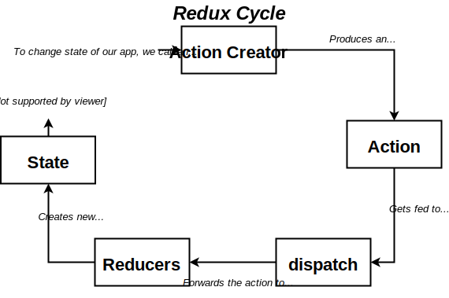
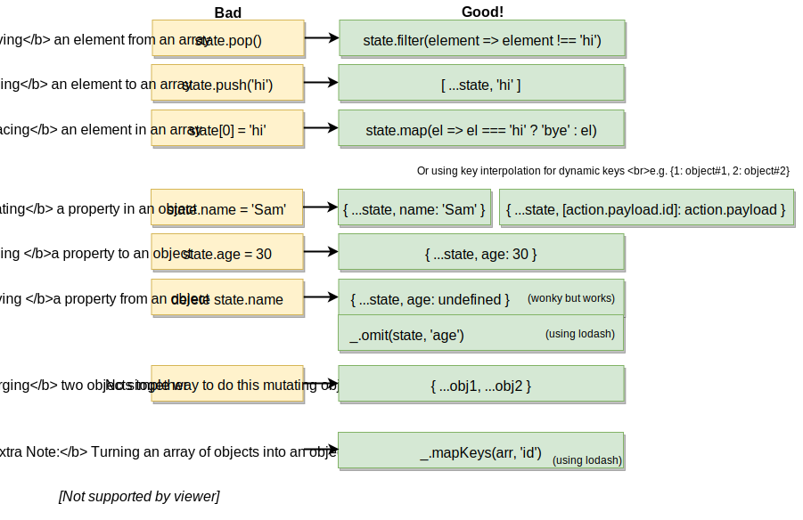
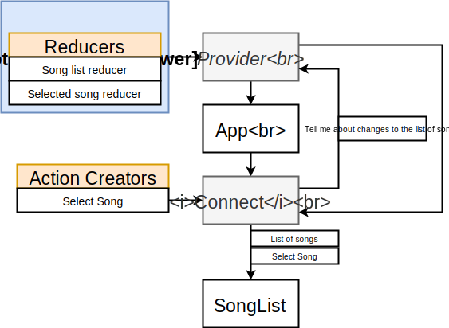
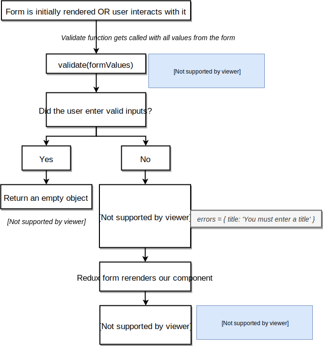

## Working with Redux
### What is Redux?
- A state management library ("state" as in React state). Redux is in charge of handling the data inside our applications.
- Makes creating _complex_ apps easier.
- NOT required to create a React app.
- NOT specifically design for React, can work with other frameworks.

### Redux benefits
Redux helps applications to keep complexity under control as they grow.


### Redux by analogy
The Udemy course has a great detailed explanation of Redux by analogy using an insurance company. Watch that to get
the full details. I put a summary of the analogy here to refresh your memory.


### The Redux Cycle 



### Action Creators
Action creators are the person dropping the form in our analogy. They are methods that take in some arguments and
return an action.  Actions are the ONLY way we can change the state in our redux store (i.e. `dispatch`ing actions).

An action is just a JS Object that follows a very particular structure.  It has a `type` that represents the
type of action it is (e.g. `CREATE_CLAIM`), and a `payload`, that contains all the extra information that
the action requires.

```jsx harmony
// ACTION CREATOR: People dropping off a form
// One action creator for each type of action in our app
const createPolicy = (name, amount) => {
  return {//Action (a from in our analogy)
    type: 'CREATE_POLICY',
    payload: {
      name: name,
      amount: amount
    }
  };
};
```

### Reducers
Reducers map to departments in our analogy.  Each reducer: 
- Receives all possible actions on the app and is in charge of listening to the actions of interest and creating a NEW
slice of state given the old **slice**of state and the nature of the action.
    - Note that the reducer receives its old SLICE of state, NOT the complete store.
    - DO NOT mutate the old slice of state, create a NEW slice of state. See [these patterns.](#patterns-for-safely-manipulating-state-in-reducers-without-mutation) 
    - Must return ANY value besides `undefined` (`null` is ok).
    - A reducer must be a PURE FUNCTION. It must NOT reach "out of itself" to decide what to return. 
        - e.g. NOT network requests, NOT DOM traversing, NOT read from hard-drive.
- If the action is of no interest to the reducer, it needs to return the slice of old state unchanged.
- It needs to initialize the slice of state it manipulates with a reasonable value (e.g. an empty array).

```jsx harmony
// REDUCERS - Depatments in our analogy
// One reducer per department
// Always takes 2 args: 
//   1. The existing piece of state for that reducer
//   2. An action (generated by an action creator) (a form in our analogy)
const claimsHistory = (oldListOfClaims = [], action) => {
  // In the first call, oldListOfClaims = undefined 
  // oldListOfClaims = [] makes sure to initialize it to an empty array
  
  if (action.type === 'CREATE_CLAIM') {
    // This reducer cares about this action
    // ES6 syntax to create a NEW array out of the old list and append the new one
    // In reducers we always want to return a NEW data structure, NOT mutate the old one
    return [...oldListClaims, action.payload]; 
  }
  
  // Reducer does not care about the action, do nothing
  return oldListOfClaims;
};

// const accounting = ...
```

#### Patterns for safely manipulating state in reducers without mutation


### Pattern: using a central place to define action types
A very common bug that is hard to trace is making a typo in the action `type` between the action creators and the
reducers.  To fix this, we can use a dedicated file `actions/types.js` to centrally declare all action types and use
these in both action creators and reducers.

```jsx harmony
// ./src/actions/types
export const SIGN_IN = 'SIGN_IN';
export const SIGN_OUT = 'SIGN_OUT';

// ./src/actions/index.js
import {SIGN_IN, SIGN_OUT} from './types';

export const signIn = () => {
  return {
      type: SIGN_IN
  };
};
// ...

// ./src/reducers/authReducer.js
import {SIGN_IN, SIGN_OUT} from '../actions/types';

const INITIAL_STATE = { isSignedIn: null };

export default (signInState = INITIAL_STATE, action) => {
    switch (action.type) {
        case SIGN_IN:
            return {...signInState, isSignedIn: true};
        case SIGN_OUT:
            return {...signInState, isSignedIn: false};
        default:
            return signInState;
    }
};
``` 

### Creating and interacting with the Redux Store
The REDUX STORE is a a data store that holds a collection of `reducers` that define how the store reacts
to `actions` created by `action creators`.

- The ONLY way to modify the data in the store is through the `dispatch` function (which in turn holds the `reducers`)
we have defined. 
    - We will NEVER write code like `store.state = {...}`

```jsx harmony
// From Redux, take createStore and combineReducers
import Redux from 'redux';
const { createStore, combineReducers } = Redux;

// Outline the collection of reducers that the store will need
// The name of the keys determine the name of the key in the store, the value is the reducer function
const ourDepartments = combineReducers({
  accounting: accounting,
  claimsHistory: claimsHistory,
  policies: policies
});

// Initialize the store using the combined reducers
const store = createStore(ourDepartments);


// Using the store
const myAction = createPolicy('Alex', 20);
store.dispatch(myAction); // Passes the action to all reducers
console.log(store.getState()); 
// => {accounting: 120, claimsHistory: [], policies: ['Alex']}
```

## Making Redux work with React
### Why do we need `react-redux`?
We need the `react-redux` library to get both working together. Remember that Redux was no specifically designed
for React. Install it by doing `npm install --save react-redux`

- In general when using React with Redux, we will no longer require to store state within the components, since 
the state is now stored within the Redux store.
    - There are some use cases when we can need both Redux State and Component State. TODO: More on this later.

### `Provider` and `Connect` components: the glue between React and Redux

The `react-redux` library provides 2 "glue" components to help React and Redux interact.


__`Provider`__
- Holds the redux store, that in turn is created using the combined reducers.
- Is the top level component of the app. See [Wiring up the provider](#wiring-up-the-provider)

__`Connect`__
- Every time we need a component to communicate with the Redux Store (through the Provider),
    we need to wrap it in a `Connect` component.
- The connect component also provides the action creators to the wrapped components.

### React with Redux Project Structure
A React + Redux project typically has this structure
- `/src`
    - `/actions`: Contains all files related to action creators.  Typically contains a main
    `index.js` file which is used as the import in other files.
    - `/components`: All component-related files.
    - `/reducers`: Reducer-related files. Also tend to include an `index.js` file.
    - `index.js`: Sets up BOTH the react and redux sides of the app.

### Named exports
Allows us to export multiple functions from a single file.
```jsx harmony
// Named Export - src/actions/index.js - We export 2 functions
export const selectSong = song => {
    return {
        type: 'SONG_SELECTED',
        payload: song
    };
};

export const someOtherActionCreator = () => {
    // ...
};
```
```jsx harmony
// Importing a named export - some_other_file.js
import { selectSong } from '../actions';
```

### Wiring up the Provider
1. Combine reducers using the `combineReducers` method from redux.
```jsx harmony
// ./reducers/index.js
import { combineReducers } from 'redux';

export const songsReducer = () => {
    // ...
};

export const selectedSong = (selectedSong=null, action) => {
 // ...
};

export default combineReducers({
    songs: songsReducer,
    selectedSong: selectedSong
});
```
2. Wrap the top level App component with a `Provider` component and pass in a __redux store__ created from
the combined reducers.
```jsx harmony
import React from 'react';
import ReactDOM from 'react-dom';
import { Provider } from 'react-redux';
import { createStore } from 'redux';

import App from './components/App';
import reducers from './reducers';

ReactDOM.render(
    <Provider store={createStore(reducers)}>
        <App/>
    </Provider>,
    document.querySelector('#root')
);
```

### Wiring up Connect
`Connect` needs to be wired up for every component that is dependent on some piece of state inside the
Redux Store OR that needs to trigger some action that updates the redux state (using action creators).

Note that components that have been wired up with `Connect` will be automatically re-rendered when the global
store changes.

There are 2 scenarios: __Class bases components__ and __Functional Components__.

__Class Based Components__

There are 2 key things to wire up:
1. How our component receives information from the global redux state: see `mapStateToProps` below.
2. The __action creators__ that our component will use to update the global store: see 2nd argument of `connect` below.

```jsx harmony
import React from 'react';
import { connect } from 'react-redux';
import {selectSong} from "../actions";

class SongList extends React.Component {
    // Helper method to render list
    renderList(){
        const songs = this.props.songs;
        const renderedSongs = songs.map( song => {
            return (
                <div className='item' key={song.title}>
                    <div className="right floated content">
                        <button className="ui button primary"
                                // This is the "wrapped" action creator function mentioned below
                                onClick={() => this.props.selectSong(song)}>
                            Select
                        </button>
                    </div>
                    <div className="content">{`${song.title} - ${song.duration}`}</div>
                </div>
            );
        });
        return renderedSongs
    }

    render() {
        return <div className='ui divided list'>{this.renderList()}</div>;
    }
}

// MAIN WIRING

// This is how we configure that we want to get this connect component to be notified of changes
// on a particular piece of state from the whole redux store.
// By convention we call this function `mapStateToProps`
const mapStateToProps = (state, ownProps) => {
    // This object is going to be mapped to the props inside the SongList.
    // i.e. Inside Songlist this.props === { songs: state.songs }
    return { songs: state.songs };
};

// `connect` takes 2 args:
// 1) The mapStateToProps function
// 2) An object with action creators (e.g. { selectSong:  selectSong }, abbreviated using ES6 syntax)
//    `connect` wraps all action creators in the `dispatch` function and maps this "wrapped" functions inside the
//     props. That is why we can call `this.props.selectSong()` directly without having to use `dispatch`
export default connect(mapStateToProps, {selectSong})(SongList);
``` 

__Functional Components__

Simpler than class-based.  We only need to `mapStateToProps` and use the `connect` function.
```jsx harmony
import React from 'react';
import { connect } from 'react-redux';

const SongDetail = (props) => {
        return (
            <div>
                <div>{props.song.title}</div>
                <div>{props.song.duration}</div>
            </div>
        );
};

const mapStateToProps = state => {
  return {song: state.selectedSong};
};

export default connect(mapStateToProps)(SongDetail);
```

### Doing pre-calculations inside `mapStateToProps`
In some cases, we need to do some bits of pre-calculation logic to map the redux global state into the 
props a particular component cares about.  `mapStateToProps` is a great place to do that pre-calculation and only
pass to the component the minimum data it needs.

The following example illustrates how we extract the particular `user` a component instance cares about form 
an array of users.
```jsx harmony
import React from 'react';
import {connect} from 'react-redux';
//...

class UserHeader extends React.Component {
    // ...
    render(){
        // ...
        return <div>{user.name}</div>
    }
}

// mapStateToProps gets called with 2 args: 
// 1) The complete redux store, 
// 2) The props that have been injected to the particular instance of the component (e.g. <UserHeader userId=2/> )
// With those 2 pieces of information, we can do any pre-calculation needed to give the component just the right
// data from the redux store.
const mapStateToProps = (state, ownProps) => {
    const user = state.users.find( user => user.id === ownProps.userId);
    return { user: user };
};
export default connect(mapStateToProps, {fetchUser})(UserHeader);
```

### Debugging Redux with the Redux Dev Tools

Redux Dev Tools is a Chrome / Firefox extension that is very helpful for debugging Redux applications.

1. Install the Chrome / Firefox add-on named "Redux Dev Tools" through the extension marketplace.
2. The dev tools require some wiring up on the code. Many sites like Airbnb leave the dev tools hooked in production.
There is no problem on doing that and anybody with the devtools can use the tool on the site.
```jsx harmony
// ...
import { createStore, applyMiddleware, compose } from "redux";
// ...

const composeEnhancers = window.__REDUX_DEVTOOLS_EXTENSION_COMPOSE__ || compose;
const store = createStore(
    reducers,
    composeEnhancers(applyMiddleware())
);

ReactDOM.render(
    <Provider store={store}>
        <App/>
    </Provider>,
    document.querySelector('#root')
);
```

Two key features of the devtools are:
- The left panel of the devtools show a timeline of all the actions that have taken place. We can use "jump" to travel
in time and revert the store to any of the moments. This will also change the app.
- With `debug_session` (e.g. `http://localhost:3000/?debug_session=my_sesh`) we can persist the redux store across
full browser reloads and store the session under a name that we can retrieve later (e.g. `my_sesh` in this example).
    - We can have as many debug sessions stored as we want.
    - To not use andy debug session, just ommit the `?debug_session=...` param in the URL.

## Making API with Redux and Redux-Thunk
### What is a Redux Middleware
Redux Middlewares are functions that slightly change the behaviour of a Redux Store, adding new capabilities to it.
The play a role in the Redux cycle.


- A middleware is a plain js function that gets called with every action that you `dispatch`.
- The middleware function has the ability to STOP, MODIFY or mess around with the action (e.g. print it to console).
- There are many open-source middlewares.
- Most popular middlewares are for dealing with async actions (like `redux-thunk`).

### General steps for loading data into a Redux app from an external API


### Common pitfall: making network requests inside action creators
This common pitfall also serves as a motivation for `redux-thunk`.

#### Common Invalid code 1
You may feel tempted to make the API network request on the action creator, but his is invalid 
redux code. The following code is invalid and will lead to the error shown below.
```jsx harmony
// actions/index.js
import jsonPlaceholder from "../apis/jsonPlaceholder";

export const fetchPosts = async () => {
    // This is invalid redux code. NO network requests in action creators.
    const response = await jsonPlaceholder.get('/posts');
    return {
        type: 'FETCH_POSTS',
        payload: response
    };
};
```
`Error: Actions must be plain objects. Use custom middleware for async actions.`

The code is invalid because in redux, action creators MUST return PLAIN JS OBJECT with a type property and an optional payload.
The `async` `await` in `fetchPosts = async() => { await...}` actually returns gets transpiled down into a
 complicated function in ES2015 that, while the network request is being done returns a different thing
 that has nothing to do with our intended plain JS object (to make it obvious, transpile it to ES2015).
 
 #### Common Invalid code 2
 To fix the previous code, you may want to directly do the request without `async` and `await`, like shown next.
 ```jsx harmony
 // actions/index.js
 import jsonPlaceholder from "../apis/jsonPlaceholder";
 
 export const fetchPosts =  () => {
     // Remember, axios (or any network library) returns a PROMISE
     const promise =  jsonPlaceholder.get('/posts');
     return {
         type: 'FETCH_POSTS',
         payload: promise
     };
 };
 ```
You won't see an error in this case, but the code won't work.

The code is invalid because by the time our action object get to a reducer we won't have
fetched the data from the API and the payload is actually a promise (not data).

### Synchronous vs Asynchronous action creators
- Synchronous: a "vanilla" function that returns an action immediately.
- Asynchronous: some action creator that needs time to resolve. NEEDS middleware (not supported by default in Redux). 
All network requests fall into this category.

### What is Redux-thunk
- `redux-thunk` is a GENERAL PURPOSE middleware. It is NOT only for async requests.
- All that `redux-thunk` does is change the rules of what action creators can return. With
`redux-thunk`:
    - Action creators CAN return actions (i.e. play JS objects with a `type` property and optionally a `payload`).
    - OR they can return a function and redux-thunk will call it for us.


### How to wire-up redux-thunk to the store
```jsx harmony
// src/index.js
import React from 'react';
import ReactDOM from 'react-dom';
import {Provider} from 'react-redux';
import {createStore, applyMiddleware} from 'redux';
import thunk from "redux-thunk";

import App from './components/App';
import reducers from './reducers';

const store = createStore(reducers, applyMiddleware(thunk));

ReactDOM.render(
    <Provider store={store}>
        <App/>
    </Provider>,
    document.querySelector('#root')
);
```

### How to create an `action-creator` that makes an API call
```jsx harmony
// actions/index.js
import jsonPlaceholder from "../apis/jsonPlaceholder";

export const fetchPosts =  () => {
    // We are going to return a function so that redux-thunk uses it.
    // This function will get called by redux-thunk with the dispatch and getState functions
    // injected as arguments.
    // We don't care about what the inner function returns, the only thing that we care is that the inner function
    // dispatches an action.
    return async (dispatch, getState) => {
            const response = await jsonPlaceholder.get('/posts');
            dispatch({ type: 'FETCH_POSTS', payload: response});
    };
};
``` 

### Toolkit: Avoiding repeated requests with memoization
Memoization can be used to 'cache' repeated outgoing requests and avoid an API getting called
more than one time for a particular parameter.

This can also be accomplished manually by [calling action creators within action creators](#calling-action-creators-within-action-creators),
but the implications are different.

**Pros**
- Does not repeat requests for users that have already been fetched (no N+1)

**Cons**
- The memoized code is hard to understand.
- If we legitimately wanted to re-fetch a user (for example if his data changed on the server), we cannot do it.

```jsx harmony
export const fetchUser = id => {
    return dispatch => {
        return _fetchUser(id, dispatch);
    };
};
// _fetchUser is a memoized function. It gets memoized for every parameter combination.
// i.e. _fetchUser(1, myDispatch) ! will NOT memoize _fetchUser(2, myDispatch)
const _fetchUser = _.memoize((async (id, dispatch) => {
    const response = await jsonPlaceholder.get(`/users/${id}`);
    dispatch({type: 'FETCH_USER', payload: response.data});
}));
```

### Calling action creators within action creators
An alternative and more standard pattern to [memoization](#toolkit-avoiding-repeated-requests-with-memoization
) for avoiding repeated requests is to call action creators within other action creators.

*Pros*
- Re-use other smaller action creators in case we need to use them stand-alone
- Allow to re-fetch data if data in server changes.

*Cons*
- Can be tricky to understand but it makes sense. Revise [the way redux-thunk works](#what-is-redux-thunk)
while looking at this code and everything should make sense.

In the following example, `fetchPosts` might return many posts from the same user and we want to make sure
we do not fetch the info for a given user more than once. 

```jsx harmony
// This "combo" action creators allow us to do custom logic and control the amount of calls that we do
export const fetchPostsAndUsers = () => {
    return async (dispatch, getState) => {

        // Hard to understand: Whenever we call an action creator within another action creator, we need to manually
        // dispatch the action and let redux-thunk handle the rest. 
        // (i.e. if it is a JS object, it will send them to  the reducers.  If it is a function, it will call it.)
        // In this example `fetchPosts()` returns an inner function. Redux-thunk will call it and that 
        // function in turn will dispatch whatever it needs to dispatch.
        await dispatch(fetchPosts()); 
        // We await for the API call to be completed before continuing, since we need the
        // data from fetchPosts for doing the processing.

        // Do some processing. eg find only the unique user Ids
        const allUserIds = _.map(getState().posts, 'userId');
        const userIds = _.uniq(allUserIds);

        // Call another action creator to fetch users
        // We don't have to use await because we no longer care when the user actually get's fetched.
        userIds.forEach( id => dispatch(fetchUser(id)));
    }
};

export const fetchPosts =  () => {
    return async (dispatch, getState) => {
            const response = await jsonPlaceholder.get('/posts');
            dispatch({ type: 'FETCH_POSTS', payload: response.data });
    };
};

export const fetchUser = (id) => {
    return async (dispatch, getState) => {
        const response = await jsonPlaceholder.get(`/users/${id}`);
        dispatch({type: 'FETCH_USER', payload: response.data});
    };
};
```

### Redux Form
__The `8_streams/client/src/components/streams/StreamCreate.js` file has a fully annotated example of a form component.__

#### Motivation
Without Redux, we use [class-level state, event handlers and controlled elements](#controlled-vs-uncontrolled-elements) 
to handle forms.

With Redux, we favor the use of the central redux store instead of class-level state. Redux form helps us with this.

#### Overview 


#### Documentation
Redux form documentation is outstanding and available at redux-form.com.  
The main highlights are the examples, here are some that you might find interesting:
- [Synchronous Validation](https://redux-form.com/8.2.2/examples/syncvalidation/): Client-side validation of form
- [Asynchronous Blur Validation](https://redux-form.com/8.2.2/examples/asyncvalidation/) How to run asynchronous server-side onBlur validation on your form when certain fields lose focus.
- [Wizard Form](https://redux-form.com/8.2.2/examples/wizard/) How to create a multi-page "wizard" form.

#### Setting up Redux Form
The only setup we need to do is wire the provided redux-form reducer to our combineReducers.
```jsx harmony
import { combineReducers } from "redux";
import { reducer as formReducer } from 'redux-form';
import authReducer from "./authReducer";

// We have to to assign the redux-form reducer to the 'form' key
export default combineReducers({
    auth: authReducer,
    form: formReducer
});
```
                  
#### Basic building-blocks of a form 
Creating a form with Redux-Form requires 3 things:
1. Wire redux form into the component that contains the form using the `reduxForm` function.
2. Wire up form fields using the `Field` wrapper component (see `Field` and `renderInput` next).
3. Wire how to handle the form submission event using `handleSubmit` to wrap our custom `onSubmit` function.
4. Wire a custom action creator to be used inside our `onSubmit` that will trigger an API request.

```jsx harmony
import React from 'react';
// Field is a react component
// reduxForm is a function
import { Field, reduxForm } from "redux-form";
import { connect } from "react-redux";
import {createStream} from "../../actions";

class StreamCreate extends React.Component {

    // When given to a Field component, redux form will call this function passing formProps.
    // formProps is an object that contains:
    //   1) Information about the the state of the field (the name, the value). Remember, we want controlled elements.
    //   2) A collection of event handlers that internally contain action creators that we need to wire to update
    //      the redux store.
    //   3) Any other custom props that we pass to the Field component that are NOT part of 1 and 2 (e.g. label in this case)
    //   4) A `meta` property that contains a bunch of meta info about the field's state including the `error` we give
    //      on validation
    // formProps.input has the shape of:
    // {name: "title", onBlur: ƒ, onChange: ƒ, onDragStart: ƒ, ..., value: "my title", meta: {error: '', ...}}
    renderInput (formProps) {
        // Under the hood we want to do something like this:
        // return <input  onChange={formProps.input.onChange} value={formProps.input.value }/>;
        // However, the {...formProps.input} syntax is a shorthand to wire everything inside the formProps.input to the
        // input component using the same keys as the ones in the object.
        return (
            <div className="field">
                <label>{formProps.label}</label>
                <input  {...formProps.input} />
            </div>
        );
    }

    // Our custom onSubmit function that will get wrapped by handleSubmit
    // handleSubmit passes the formValues as an argument.
    // e.g. formValues:  {title: "my title", description: "my description"}
    // handleSubmit does NOT call our custom onSubmit function if the form has errors.
    onSubmit = (formValues) => {
        this.props.createStream(formValues);
    };

    render() {
        return (
            // handleSubmit is injected by redux-form and wraps our custom 'onSubmit' function.
            // - It preventsDefault so that we don't need to do it
            // - It gets all the form values and passes them as an argument to our 'onSubmit' function.
            <form className="ui form" onSubmit={this.props.handleSubmit(this.onSubmit)}>

                {/* Field is a wrapper for any type of input that wires up all the redux-form infrastructure required. */}
                {/* Field needs some props: */}
                {/* - name: the name of the property this field is going to manage */}
                {/* - component: a component or a function that actually returns the field to be rendered */}
                {/*   - the function will be called with the formProps argument */}
                <Field name='title' component={this.renderInput} label="Enter Title"/>
                <Field name='description' component={this.renderInput} label="Enter Description"/>
                <button className="ui button primary">Submit</button>
            </form>
        );
    }
}


// reduxForm is a function that serves an similar purpose connect function from react-redux
// but limited to redux-form instrumentation.
//   - It maps the state of the redux store to the props of the component
//   - It injects the necessary action creators
// reduxForm receives a single object to configure it
//   - 'form' can be any string to describe the purpose of the form
// @return The return of reduxForm(...)(StreamCreate) is a component that is our
// component wrapped by reduxForm
const formWrapped = reduxForm({
    form: 'streamCreate'
})(StreamCreate);

// To inject custom state or action creators (not related to redux-form), we
// still need to use connect.
export default connect(null, {createStream})(formWrapped);
```

#### Client-side field validation


The example shows how to do client-side validation that is rendered only after the field has been touched.

```jsx harmony
import React from 'react';
// Field is a react component
// reduxForm is a function
import { Field, reduxForm } from "redux-form";

class StreamCreate extends React.Component {
    // formProps is an object that contains a `meta` property that contains a bunch of meta info about the field's 
    // state including the `error` we give on validation and whether the field has been touched
    renderInput = (formProps) => {
        const meta = formProps.meta;
        const className = `field ${meta.error && meta.touched ? 'error' : ''}`;
        return (
            <div className={className}>
                <label>{formProps.label}</label>
                <input  {...formProps.input} />
                { this.renderError(meta) }
            </div>
        );
    };
    
    // Helper function to decide when to render errors
     renderError ({error, touched}) {
        if (error && touched) {
            return (
                <div className="ui error message">
                    <div className="header">{error}</div>
                </div>
            );
        }
    };
    
    // handleSubmit does NOT call our custom onSubmit function if the form has errors.
    onSubmit = (formValues) => {
        // ...
    };

    render() {
        return (
            <form className="ui form" onSubmit={this.props.handleSubmit(this.onSubmit)}>
                {/* The errors get injected into the formProps that are passed to the component functions */}
                <Field name='title' component={this.renderInput} label="Enter Title"/>
                <Field name='description' component={this.renderInput} label="Enter Description"/>
                <button className="ui button primary">Submit</button>
            </form>
        );
    }
}

// We define this function OUTSIDE the component and wire it in into the component
// using the `reduxForm` function.
// The function gets called with a `formValues` object that contains the values of each Field using the name as key
// e.g. { title: 'My title', description: 'My description' }
// If the fields are ok, then we must return an empty objects
// Else we must return an object that contains the fields with errors along with a message. The match with the
// Field names is VERY IMPORTANT
const validate = (formValues) => {
    const errors = {};
    if (!formValues.title) {
        errors.title = 'You must enter a title';
    }
    if (!formValues.description) {
        errors.description = 'You must enter a description';
    }
    return errors;
};

export default reduxForm({
    form: 'streamCreate',
    validate: validate
})(StreamCreate);
```

#### Form component re-usability in redux-form
This section shows a pattern for re-using a form component for a very common use case `new` and `edit` forms.  The 
diagram shows the high-level strategy for re-use.
 


The key points are:
- `onSubmit` is injected as a prop into the wrapped `StreamForm` component.
- The `initialValues` property of any component that has been wrapped by `redux-form` is a special prop that
allows us to set the values of the `form` object in the redux store, which in turns changes the value of the
`Field` components inside the forms.
- Use `StreamForm` within both the `StreamCreate` and the `StreamEdit` components. 

```jsx harmony
// StreamForm
import React from 'react';
import { Field, reduxForm } from "redux-form";


class StreamForm extends React.Component {
    // Redux form automatically changes the formProps with the initialValues prop 
    renderInput = (formProps) => {
        const meta = formProps.meta;
        const className = `field ${meta.error && meta.touched ? 'error' : ''}`;
        return (
            <div className={className}>
                <label>{formProps.label}</label>
                <input {...formProps.input} />
                { this.renderError(meta) }
            </div>
        );
    };

    renderError ({error, touched}) { 
        // ... 
    };

    // onSubmit uses the injected onSubmit prop defined by the parent component.
    onSubmit = (formValues) => { this.props.onSubmit(formValues) };

    render() {
        return (
            // Everything else is the same as any form
            <form className="ui form error" onSubmit={this.props.handleSubmit(this.onSubmit)}>
                <Field name='title' component={this.renderInput} label="Enter Title"/>
                <Field name='description' component={this.renderInput} label="Enter Description"/>
                <button className="ui button primary">Submit</button>
            </form>
        );
    }
}

const validate = (formValues) => {
    // ... 
};

// Returns the wrapped StreamForm
// Note that the 'streamForm' key will be shared inside the redux-store for both new and edit forms
export default reduxForm({
    form: 'streamForm',
    validate: validate
})(StreamForm);
```
```jsx harmony
// Stream Edit
import React from 'react';
import { connect } from 'react-redux';
import { fetchStream, editStream } from "../../actions";
import StreamForm from "./StreamForm";


class StreamEdit extends React.Component {
    componentDidMount() {
        // Load data for this component to work
    }
    
    // Our custom onSubmit function that will get injected into the StreamForm component as a prop 
    onSubmit  = (formValues) => {
      this.props.editStream(this.props.stream.id, formValues);
    };

    render(){
        if (!this.props.stream) {
            return <div>Loading...</div>;
        }
        const {title, description} = this.props.stream;
        return (
            <div>
                <h3>Edit Stream</h3>
                {/* InitialValues is a special redux-form prop to indicate the form values of the StreamForm */}
                {/* Make sure you only pass initial values that have a corresponding Field in the form */}
                <StreamForm initialValues={{title, description}}
                            onSubmit={this.onSubmit}/>
            </div>
        );
    }
}

const mapStateToProps = (state, ownProps) => {
    const urlId = ownProps.match.params.id;
    return {
        stream: state.streams[urlId]
    };
};

export default connect(mapStateToProps, {fetchStream, editStream})(StreamEdit);
```


